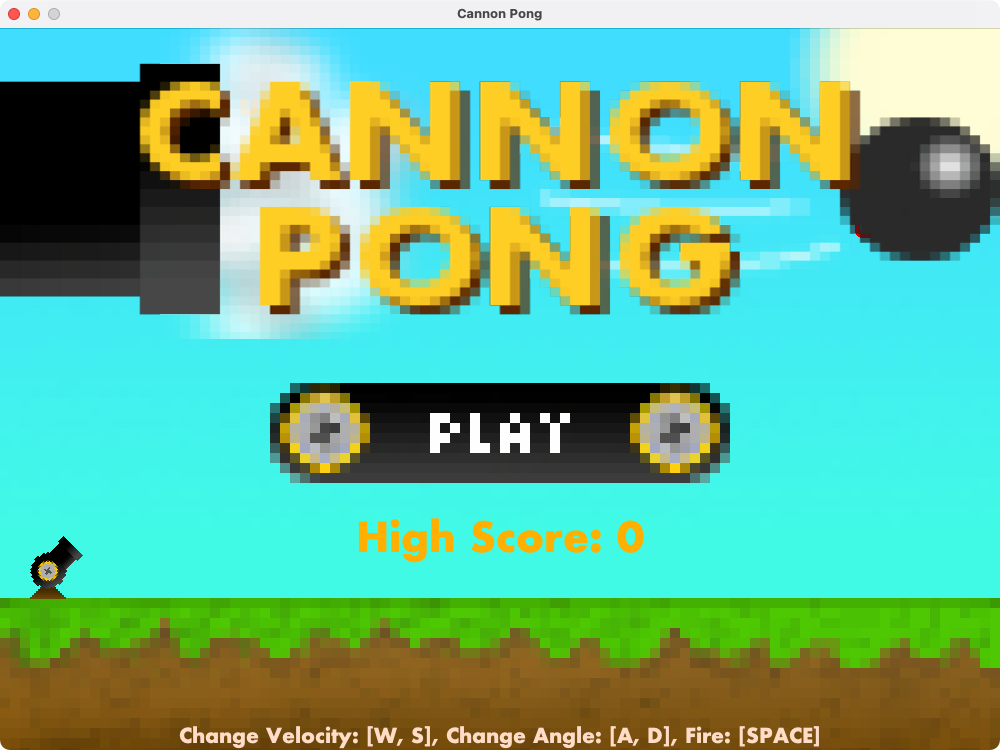
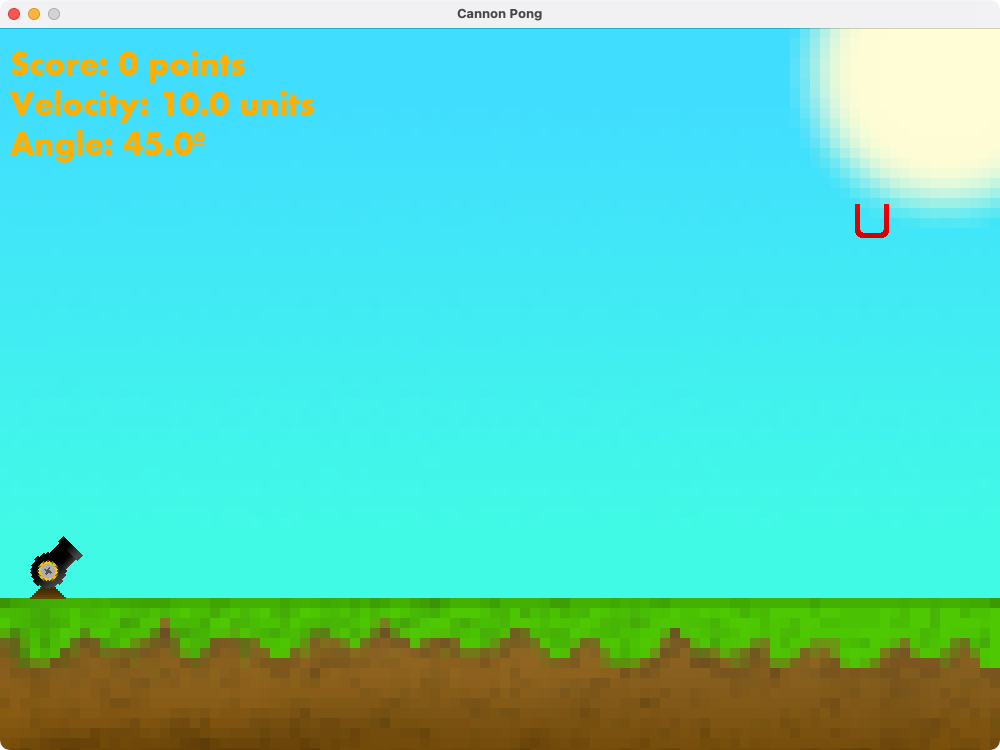

# CannonPong

## About
CannonPong is like a 2D basketball or cup pong game. You can adjust the launch speed and angle of a ball in an attempt to shoot the ball into a cup. The cup will move around when you make it in, and your score will reset if you fail to do so.

## Purpose
This game was written as a group project for CprE 186 at Iowa State University. It used Floobits as version control in the beginning, so the other students' contributions do not show up. Due to COVID-19, our time to produce this was shortened heavily, so it is not all that complex.

## Running
To run, simply download the jar from the release, then double click the jar file to run it. A file called score.txt will be generated in the same folder as the jar file, which will hold score data. Java 8+ is required to run this.

## Screenshots

### Start Screen
This is what the game will open to. Aside from the large play button, there is a list of controls at the bottom, and high score text above that. All of these, as well as the logo, disappear when you click play.

### Game UI
This is what the game looks like while playing. You can see your score, tbe launch velocity, and the launch angle. The cup (red U-shaped object) is also placed in the window. This will move when you get the ball in it.

## Other
This game was written using the early version of the physics found in the Java 2.5D game engine, [Pseudo3D](https://github.com/jeremynoesen/Pseudo3D).

This repository was originally part of an organization made for this group, but I have cloned the repo for archiving onto my account due to the organization being abandoned.
